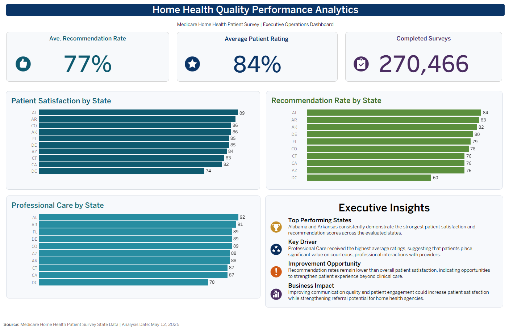

# Home Health Quality Performance Analytics

### Medicare Home Health Patient Experience | Healthcare Operations & Executive Analytics

Transforming Medicare Home Health patient-experience data into actionable operational insights through **healthcare analytics, exploratory machine learning, scenario modeling, and business intelligence**.

This project analyzes state-level Medicare Home Health quality data to identify operational measures associated with patient satisfaction and demonstrate how analytics can support healthcare quality-improvement and executive decision-making.

---

## Executive Dashboard



**Interactive analytics developed in Tableau to monitor patient satisfaction, recommendation rates, professional care performance, and survey volume across states.**
---

## Project Overview

Healthcare organizations continuously monitor patient experience and quality measures to identify performance gaps, improve care delivery, and support operational decision-making.

This project analyzes Medicare Home Health patient survey data to evaluate state-level quality performance and identify operational factors associated with overall patient satisfaction.

The analysis combines:

- Healthcare Operations
- Exploratory Data Analysis
- Statistical Relationship Analysis
- Machine Learning
- Sensitivity Testing
- Scenario Modeling
- Tableau Business Intelligence
- Executive Reporting

The goal is not simply to generate predictions, but to translate healthcare quality data into **actionable insights that healthcare leaders can use to prioritize improvement opportunities**.

---

## Business Problem

Patient satisfaction is influenced by multiple dimensions of the care experience, including communication, professional care delivery, safety discussions, and overall service quality.

Healthcare leaders need to understand:

1. Which quality measures are most strongly associated with patient satisfaction?
2. Which operational areas may represent the strongest opportunities for improvement?
3. Can machine learning help identify important operational features associated with healthcare performance?
4. How can analytics support executive quality-improvement decision-making?
---

## Key Findings

The analysis consistently identified **Communication** and **Professional Care** as the strongest operational signals associated with overall patient satisfaction.

### Relationship Analysis

- **Professional Care** demonstrated the strongest direct relationship with Patient Rating (**r = 0.982**).
- **Communication** also demonstrated a very strong relationship with Patient Rating (**r = 0.964**).
- These relationships indicate strong associations within the analyzed state-level data and should not be interpreted as evidence of causation.

### Exploratory Machine Learning

A Random Forest model was used to provide an additional perspective on operational feature importance.

Leave-one-state-out sensitivity testing produced the following average feature importance:

| Operational Feature | Mean Importance |
|---|---:|
| Communication | **0.312** |
| Professional Care | **0.262** |
| Pain Medicines & Home Safety | 0.230 |
| Response Rate | 0.110 |
| Completed Surveys | 0.085 |

Communication ranked highest on average, while Professional Care demonstrated particularly stable importance across sensitivity iterations.

### Operational Scenario Analysis

Using observed 75th-percentile performance values as improvement benchmarks:

| Scenario | Predicted Patient Rating | Change vs. Baseline |
|---|---:|---:|
| Baseline | 84.60% | — |
| Improve Communication | **85.30%** | **+0.70 pp** |
| Improve Professional Care | 84.79% | +0.19 pp |
| Improve Both | **85.48%** | **+0.88 pp** |

The strongest modeled scenario occurred when **Communication and Professional Care were improved together**, while Communication produced the largest individual modeled improvement.

> **Interpretation:** These results identify data-informed areas for further quality-improvement evaluation. Scenario estimates are model-based and should not be interpreted as guaranteed outcomes of operational interventions.
---

## Project Workflow

The project follows an end-to-end healthcare analytics workflow designed to move from raw quality data to executive decision support.

```text
Medicare Home Health Survey Data
              │
              ▼
     Data Quality Review
              │
              ▼
 Exploratory Data Analysis
              │
              ▼
   Relationship Analysis
              │
              ▼
Exploratory Machine Learning
              │
              ▼
     Sensitivity Testing
              │
              ▼
 Operational Scenario Analysis
              │
              ▼
 Executive Recommendations
              │
              ▼
 Tableau Executive Dashboard
```

### Analytical Methodology

**Data Quality Review**  
Evaluated dataset structure, missing values, duplicate records, data types, and summary statistics before analysis.

**Exploratory & Relationship Analysis**  
Examined state-level quality performance and used correlation analysis to identify measures strongly associated with overall Patient Rating.

**Exploratory Machine Learning**  
Applied a Random Forest Regressor to evaluate the relative importance of operational features including Communication, Professional Care, Pain Medicines & Home Safety, Response Rate, and Completed Surveys.

**Sensitivity Testing**  
Used leave-one-state-out analysis to evaluate whether feature-importance rankings remained reasonably consistent when individual states were removed.

**Operational Scenario Modeling**  
Compared modeled Patient Rating under realistic improvement scenarios using observed 75th-percentile performance benchmarks for Communication and Professional Care.

**Business Intelligence**  
Developed an interactive Tableau Executive Dashboard to translate analytical findings into state-level performance monitoring and executive decision support.
---

## Tools & Technologies

| Category | Technologies |
|---|---|
| Programming | Python |
| Data Analysis | Pandas, NumPy |
| Machine Learning | Scikit-learn |
| Visualization | Matplotlib, Tableau |
| Development | Jupyter Notebook |
| Data Source Format | Microsoft Excel |
| Version Control | Git & GitHub |

### Analytical Techniques

- Exploratory Data Analysis (EDA)
- Data Quality Assessment
- Correlation Analysis
- Random Forest Regression
- Feature Importance Analysis
- Leave-One-State-Out Sensitivity Testing
- Operational Scenario Modeling
- Executive Dashboard Development
---

## Repository Structure

```text
Home-Health-Quality-Analytics/
│
├── README.md
├── .gitignore
│
├── data/
│   └── Home Health Care Patient Survey State Data.xlsx
│
├── notebooks/
│   └── Healthcare_Quality_Analytics_Portfolio.ipynb
│
├── dashboards/
│   └── Home_Health_Quality_Executive_Dashboard.twb
│
├── images/
│   └── executive_dashboard.png
│
└── documentation/
    ├── Analysis_Inventory.docx
    └── Project_Vision.docx
```

### Key Project Files

- **Jupyter Notebook:** Complete analytical workflow, including data review, relationship analysis, exploratory machine learning, sensitivity testing, scenario modeling, and executive findings.
- **Tableau Workbook:** Interactive executive dashboard for monitoring state-level healthcare quality performance.
- **Dataset:** Medicare Home Health patient survey state data used throughout the analysis.
- **Project Documentation:** Supporting analysis inventory and original project vision documenting the project's analytical foundation and development.
---

## Business Impact

The analysis identified **Communication and Professional Care** as the most consistent operational signals associated with patient satisfaction.

For healthcare leaders, these findings provide data-informed areas for further quality-improvement evaluation, including patient communication, care-plan education, responsiveness, and professional care delivery.

Because the analysis contains only **10 state-level observations**, the machine-learning and scenario results are exploratory and should not be interpreted as causal or production-ready predictions.

---

## About the Author

### Angeline Duarte

**Healthcare Operations & Technology | Systems Analysis | Data Analytics**

This repository is part of my professional portfolio showcasing healthcare analytics, business intelligence, machine learning, and healthcare technology projects.

- Portfolio: [Click Here](https://www.angelineduarte.com/)
- LinkedIn: [Click Here](https://www.linkedin.com/in/angelineduarte/)

---

If you found this project interesting, feel free to explore the repository or connect with me on LinkedIn.
